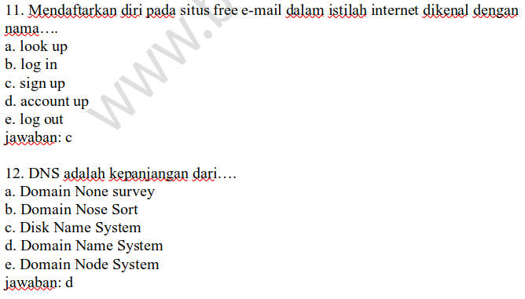

# Open Domain Question Answering

## Instruction

> Pay attention to your current working dictionary (`pwd`) and parameter of command

1. Download Indonesian Wikipedia from https://dumps.wikimedia.org/idwiki/. For example i'll download `idwiki-20210301-pages-articles.xml.bz2`
2. Extract downloaded file. You'll get single XML with big size.
3. Use `wikiextractor` library to clean the XML file.

```
python -m wikiextractor.WikiExtractor ./dataset/idwiki-20210301-pages-articles.xml -b 10000000 -o ./dataset/xml --processes 11
```

4. Use script `01_xml_to_txt.py` to split XML file into TXT file, where each TXT file represent single Wikipedia article.

```
python 01_xml_to_txt.py ./dataset/xml/**/* ./dataset/txt ./dataset/txt/**/*
```

> Your file/directory should look like this

```
├── B_open_domain_question_answering
│   ├── dataset
│   │   ├── debug_totxt.log
│   │   ├── example_worksheet.png
│   │   ├── idwiki-20210301-pages-articles.xml
│   │   ├── idwiki-20210301-pages-articles.xml.bz2
│   │   ├── question_sheet.csv
│   │   ├── txt
│   │   │    ├── 0000000
│   │   │    │    ├── 0000001_Asam_deoksiribonukleat.txt
│   │   │    │    ├── 0000002_Asam_Deoksiribosanukleat.txt
│   │   │    │    └── ...
│   │   │    ├── 0010000
│   │   │    └── ...
│   │   └── xml
│   │        ├── AA
│   │        │    ├── wiki_00
│   │        │    ├── wiki_01
│   │        │    └── ...
│   │        ├── AB
│   │        └── ...
│   ├── 01_clean_xml.sh
│   ├── 02_xml_to_txt.py
│   └── ...
```


5. Install this library

```
pip install farm-haystack==0.7.0
```

## Dataset

There are 2 datasets used in this study case. First dataset is "Indonesian Wikipedia", where whole article from 1 Match 2021 is used. Second dataset is worksheet for high school student. This dataset comes from obtained from https://www.bospedia.com. Website's disclamer page mention we may use the material for non-commercial usage, so it can be used for this study case.



There are 50 questions chosen to create CSV dataset. Those questions comes from 5 different subject, where 10 questions is taken from each subject. Only question with memorization type where the answer isn't located on image or question itself is chosen. Those questions also paraphrased using [Five Ws](https://en.wikipedia.org/wiki/5W1H) as additional performance evaluation. This dataset is included on this repository under filename `question_sheet.csv`.


| Mata pelajaran                                  | Worksheet type         | Grade X | Grade XI | Grade XII | Total questions |
| ----------------------------------------------- | ---------------------- | ------- | -------- | --------- | --------------- |
| *Biologi*/Biology                               | Final examination/test | 6       | 4        | 0         | 10              |
| *PKn*/Civic education                           | Final examination/test | 5       | 3        | 2         | 10              |
| *Sejarah*/History                               | Final examination/test | 5       | 4        | 1         | 10              |
| *Seni Budaya*/Art and Culture                   | Final examination/test | 4       | 3        | 3         | 10              |
| *TIK*/Information and communications technology | End-of-semester test   | 6       | 3        | 1         | 10              |
|                                                 | Total questions        | 26      | 17       | 7         | 50              |

## Performance evaluation

To perform evlauation, top-5 accuracy is used as metric. Question Answering evaluation usually is done automatically using metric such as BLEU, METEOR and Sentence Mover’s Similarity (SMS). But in this case, evaluation is done manually using 8 criteria which shown on table below.

| #   | Criteria                  | Question                                                                                              | True answer                 | Candidate answer                                                                                         |
| --- | ------------------------- | ----------------------------------------------------------------------------------------------------- | --------------------------- | -------------------------------------------------------------------------------------------------------- |
| 1   | Exactly same              | Siapakah yang menciptakan Tari Kebyar?                                                                | I Mario                     | I Mario                                                                                                  |
| 2   | Short answer              | Hukum internasional apakah yang mengatur hubungan internasional antar negara?                         | hukum perdata internasional | maka hukum perdata                                                                                       |
| 3   | Long answer               | Bagaimana masyarakat Hindu melihat waktu?                                                             | siklus tanpa akhir          | waktu sebagai sebuah siklus yang terus berulang tanpa akhir                                              |
| 4   | Other correct answer      | Apa bahan utama untuk membuat vas bunga?                                                              | tanah liat                  | baik kaca maupun porselin                                                                                |
| 5   | Specific answer           | Burung kakaktua, kasuari, dan cenderawasih merupakan burung khas yang banyak ditemukan di daerah      | Kawasan Timur Indonesia     | Mereka ditemukan di Indonesia Timur Papua, Papua Neguniea, pulau pulau selat Torres, dan Australia timur |
| 6   | Contain unrelevant word   | Tumbuhan yang bakal bijinya tidak dilindungi bakal buah adalah                                        | Gymnospermae                | pada Gymnospermae                                                                                        |
| 7   | Different language        | Apa nama alat atau perangkat yang digunakan untuk memindahkan gambar dari kertas ke komputer disebut? | scanner                     | pemindai                                                                                                 |
| 8   | Mention example as answer | Tempat ibadah umat Buddha                                                                             | Wihara                      | Vihara Dhammasoka                                                                                        |

Both ktrain and haystack using model `salti/bert-base-multilingual-cased-finetuned-squad` to answer the question. However haystack doesn't have option to rerank answer by similarity between question and it's answers. Based on evaluation result, it's ktrain heavily outperform Haystack. Questions which paraphrased using Five 5w also boost ktrain performance.

| Experiment #                                    | 1        | 2        | 3        | 4        | 5        | 6        |
| ----------------------------------------------- | -------- | -------- | -------- | -------- | -------- | -------- |
| Library                                         | Ktrain   | Ktrain   | Ktrain   | Ktrain   | Haystack | Haystack |
| N considered docs.                              | 16       | 16       | 8        | 8        | 16       | 16       |
| Rerank threshold                                | 0.05     | 0.05     | 0.02     | 0.02     | -        | -        |
| Question Type                                   | Default  | 5W1H     | Default  | 5W1H     | Default  | 5W1H     |
| *Biologi*/Biology                               | 0.30     | 0.30     | 0.20     | **0.40** | 0.30     | 0.10     |
| *PKn*/Civic education                           | 0.40     | **0.60** | 0.50     | **0.60** | 0.30     | 0.30     |
| *Sejarah*/History                               | 0.50     | **0.60** | 0.40     | **0.60** | 0.00     | 0.00     |
| *Seni Budaya*/Art and Culture                   | 0.40     | **0.50** | 0.40     | **0.50** | 0.30     | 0.20     |
| *TIK*/Information and communications technology | **0.50** | 0.40     | **0.70** | 0.40     | 0.10     | 0.10     |
| **Top-5 accuracy**                              | 0.42     | 0.48     | 0.44     | **0.50** | 0.20     | 0.14     |
